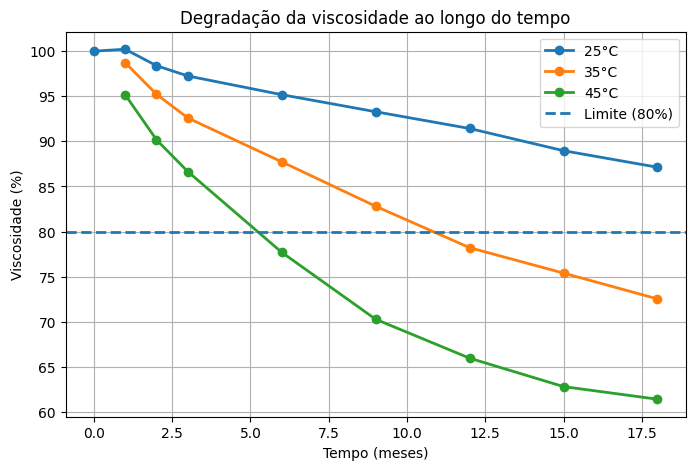
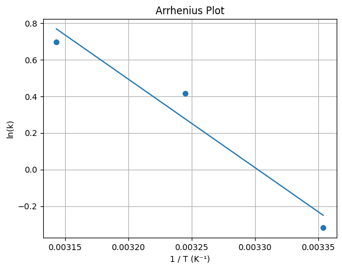

# Predição de Shelf-Life via Cinética de Degradação de Viscosidade

Este projeto demonstra como a análise de dados pode ser aplicada para avaliar a estabilidade de um sistema alimentício semissólido (matriz análoga a extratos/purês) e prever sua vida de prateleira com base na degradação da viscosidade.

A predição de shelf-life é essencial para definir validade comercial, reduzir perdas logísticas e garantir a qualidade do produto ao longo da cadeia de distribuição.

---

## Objetivo

Modelar a perda de viscosidade ao longo do tempo sob diferentes condições de armazenamento e avaliar o impacto da temperatura na estabilidade do produto.

O estudo busca suportar a estimativa de shelf-life utilizando uma abordagem orientada por dados, integrada a princípios de cinética química e ciência dos alimentos.

---

## Dataset

O conjunto de dados representa um estudo experimental controlado e inclui:

- Múltiplos lotes de produção  
- Armazenamento em diferentes temperaturas (25°C, 35°C, 45°C)  
- Medições ao longo do tempo  
- Valores de viscosidade (cP)  

---

## Metodologia

A análise foi estruturada em etapas organizadas, seguindo boas práticas de ciência de dados:

- **Cleaning:** limpeza e padronização dos dados  
- **EDA (Exploratory Data Analysis):** análise exploratória e identificação de padrões  
- **Modeling:** modelagem da degradação e ajuste cinético  

### Etapas específicas:

- Limpeza e pré-processamento dos dados  
- Visualização da degradação da viscosidade ao longo do tempo  
- Avaliação da variabilidade entre lotes  
- Cálculo da taxa de degradação (k)  
- Aplicação do modelo de Arrhenius  

---

## Resultados

### Degradação da viscosidade ao longo do tempo

**Figura 1:** Cinética de degradação da viscosidade relativa (%) sob três condições isotérmicas.

Os resultados mostram uma redução consistente na viscosidade ao longo do armazenamento, com degradação mais acelerada em temperaturas mais elevadas.

O **critério de fim de vida útil (end-of-shelf-life criterion)** foi definido como **80% da viscosidade inicial**.

A partir desse limite:

- A **45°C**, o produto atinge o critério em aproximadamente **5 meses**  
- A **25°C**, o produto permanece acima do limite durante todo o período avaliado  

Esse comportamento é consistente com alterações físico-químicas típicas, como quebra estrutural e aumento da mobilidade molecular.

---

### Variabilidade entre lotes

**Figura 2:** Variabilidade entre lotes ao longo do armazenamento.

A variabilidade entre lotes permaneceu relativamente controlada, indicando consistência no processo produtivo.

A dispersão observada é compatível com condições reais de manufatura e não compromete a tendência global de degradação.

---

### Modelagem de Arrhenius

**Figura 3:** Relação de Arrhenius (ln(k) vs 1/T).

A dependência térmica da degradação foi modelada pela equação:

A regressão linear apresentou **alta linearidade (R² > 0.90)**, indicando forte aderência ao modelo cinético.

A partir do coeficiente angular da reta (-Ea/R), foi possível estimar a **Energia de Ativação (Ea)** do sistema, confirmando a sensibilidade do produto à temperatura.

Esse resultado permite:

- Extrapolar a vida útil para temperaturas não testadas experimentalmente  
- Prever comportamento em diferentes condições logísticas  
- Aplicar conceitos de **Accelerated Shelf-Life Testing (ASLT)**  

---

## Discussão

A temperatura demonstrou ser o principal fator de aceleração da degradação da viscosidade.

O aumento térmico intensifica a mobilidade molecular e acelera a quebra da estrutura do sistema, levando à perda de consistência.

O perfil cinético obtido indica um sistema claramente dependente da temperatura, compatível com mecanismos de degradação físico-química em alimentos semissólidos.

A baixa variabilidade entre lotes reforça a robustez dos dados e a confiabilidade do modelo para aplicações preditivas.

---

## Por que Python para Estabilidade de Alimentos?

Nesta análise, a transição do Excel para o Python permitiu uma abordagem significativamente mais robusta e escalável:

### Tratamento de Dados Complexos  
O uso de `ffill()` e manipulação de strings com Pandas automatizou a limpeza de planilhas de coleta manual, evitando inconsistências como variações de temperatura ("25 C" vs "25°C").

### Rigor Estatístico  
A utilização de `scipy.stats` permitiu extrair métricas como **R², erros padrão e p-valores**, garantindo validação estatística da regressão.

### Modelagem Preditiva de Arrhenius  
A conversão automática para Kelvin e a linearização logarítmica permitiram calcular com precisão a **Energia de Ativação (Ea)**, parâmetro crítico para previsão de shelf-life.

### Visualização de Variabilidade  
A geração automatizada de gráficos com barras de erro (desvio padrão) permitiu análise simultânea de múltiplos lotes, algo operacionalmente complexo em ferramentas manuais.

A integração de bibliotecas como **Pandas, Matplotlib e SciPy** transformou dados brutos em **insights acionáveis**, permitindo que o modelo não apenas descreva o comportamento passado, mas atue como ferramenta preditiva.

---

## Conclusão

Este projeto demonstra como a integração entre ciência de dados e ciência dos alimentos permite avaliar a estabilidade de produtos de forma estruturada, quantitativa e preditiva.

Os resultados confirmam a temperatura como fator crítico na degradação da viscosidade e validam o uso de modelagem cinética para estimativa de shelf-life.

Além disso, a abordagem permite:

- Reduzir o tempo de testes experimentais em tempo real  
- Utilizar testes acelerados (ASLT) para prever falhas  
- Apoiar decisões industriais com base em dados  

Esse tipo de análise é diretamente aplicável à indústria de alimentos, contribuindo para otimização de processos, redução de perdas e melhoria da qualidade do produto.

---

## Autor

**Marina Mendonça**  
Food Science Data Analyst
