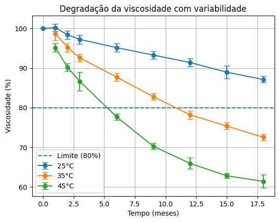

# Shelf Life Analysis – Viscosity Degradation

This project demonstrates how data analysis can be applied to evaluate product stability and predict shelf life based on viscosity degradation in a semi-solid food system.

## Objective

To model viscosity loss over time under different storage conditions and estimate product shelf life using data-driven approaches. The study also evaluates temperature influence on degradation behavior, supporting stability assessment and decision-making.

## Dataset

The dataset simulates industrial conditions and includes:

- Multiple production batches  
- Storage at different temperatures (25°C, 35°C, 45°C)  
- Time-based measurements  
- Viscosity values (cP)  

## Methodology

The analysis followed a structured workflow:

- Data cleaning and preprocessing  
- Exploratory data analysis  
- Visualization of degradation trends  
- Evaluation of variability between batches  
- Regression-based interpretation of degradation behavior  
- Conceptual application of temperature dependence (Arrhenius approach)  

## Project Structure

## Results

### Viscosity degradation over time

The results show a consistent decrease in viscosity over storage time, with a clear acceleration of degradation at higher temperatures. This behavior indicates strong temperature dependence and aligns with expected physicochemical degradation mechanisms in semi-solid systems.

### Batch-to-batch variability

Variability between batches remains controlled, suggesting process consistency under the evaluated conditions. The observed dispersion is within expected limits for experimental and industrial scenarios.

## Key Insights

- Temperature significantly accelerates viscosity degradation  
- Higher storage temperatures reduce product stability  
- The degradation pattern supports predictive modeling approaches  
- Data analysis enables objective shelf life estimation  
- Variability between batches is manageable and does not compromise interpretation  

## Conclusion

This study demonstrates how combining data analysis with food science principles can support shelf life evaluation in a structured and quantitative way.

The results confirm that temperature is a critical factor in viscosity degradation, directly impacting product stability. By applying data-driven approaches, it is possible to estimate shelf life more reliably, reduce uncertainty, and support decision-making in product development and quality control.

This type of analysis is directly applicable to real industrial scenarios, contributing to improved process understanding, risk reduction, and optimization of storage conditions.

## Author

Marina Mendonça  
Food Science Data Analyst
